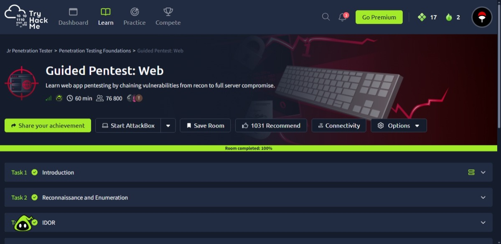

# Guided Pentest: Web — TryHackMe

## Overview

Completed the **Guided Pentest: Web** room on TryHackMe as part of my cybersecurity learning journey.

**Platform:** TryHackMe
**Category:** Web Application Security
**Focus:** Web penetration testing
**Status:** Completed

## What I Learned

This room helped me practice the methodology involved in a web application penetration test, including:

* Reconnaissance and enumeration
* Identifying web application vulnerabilities
* Understanding IDOR vulnerabilities
* Following an attack chain during a penetration test
* Thinking methodically when investigating a web application
* Understanding how individual vulnerabilities can contribute to a larger compromise

## Key Takeaways

One of my main takeaways was the importance of **enumeration and understanding how an application works before attempting to exploit vulnerabilities**.

The room also helped me understand how seemingly separate weaknesses can be connected during a penetration test.

## Evidence

I completed the room with **100% progress**.

## Disclaimer

This write-up is for educational purposes and documents my learning experience in an authorized TryHackMe training environment.

No real-world systems were targeted.

## Platform

[TryHackMe](https://tryhackme.com/)
